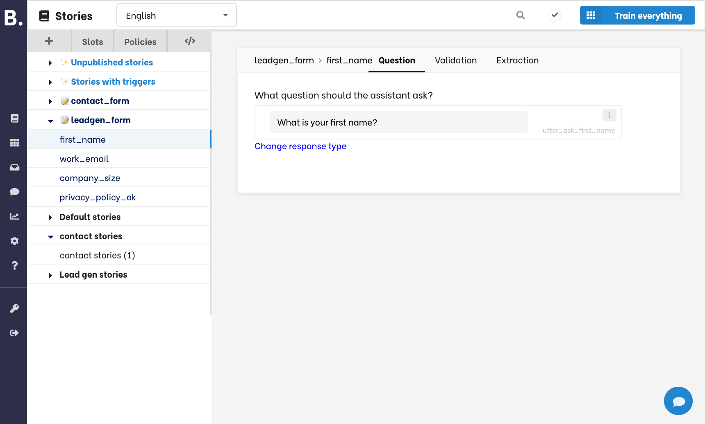
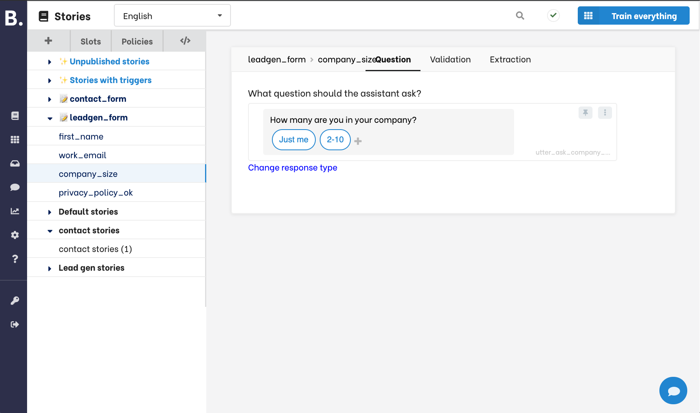
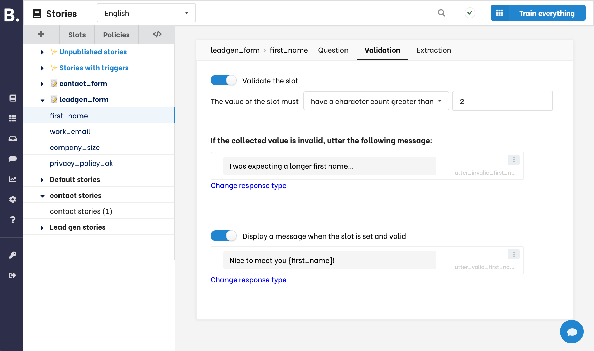
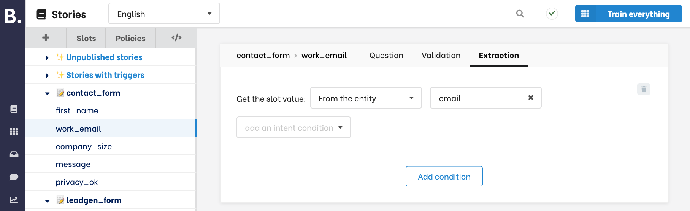
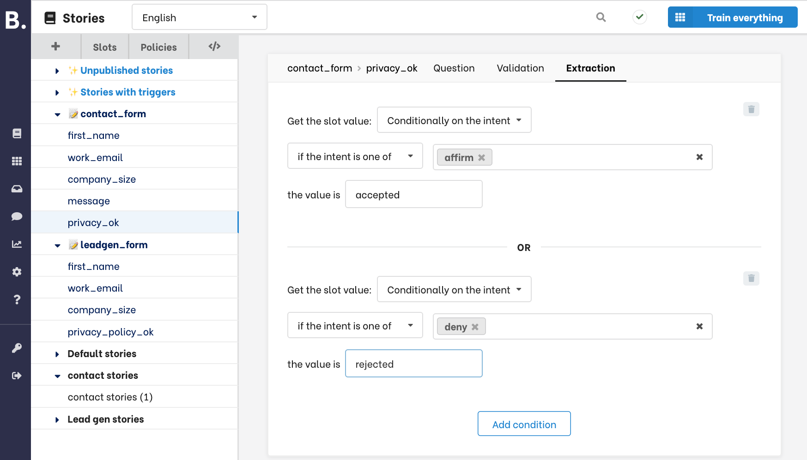
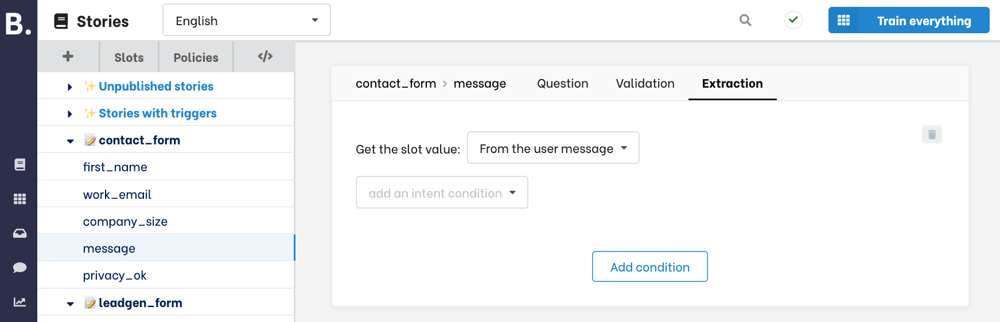
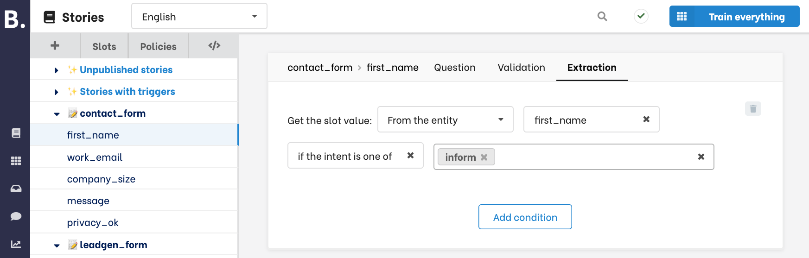
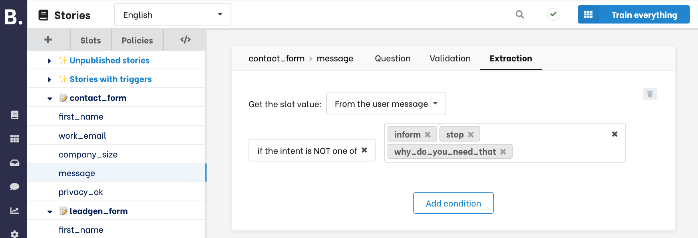
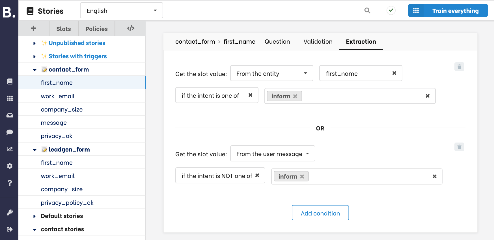
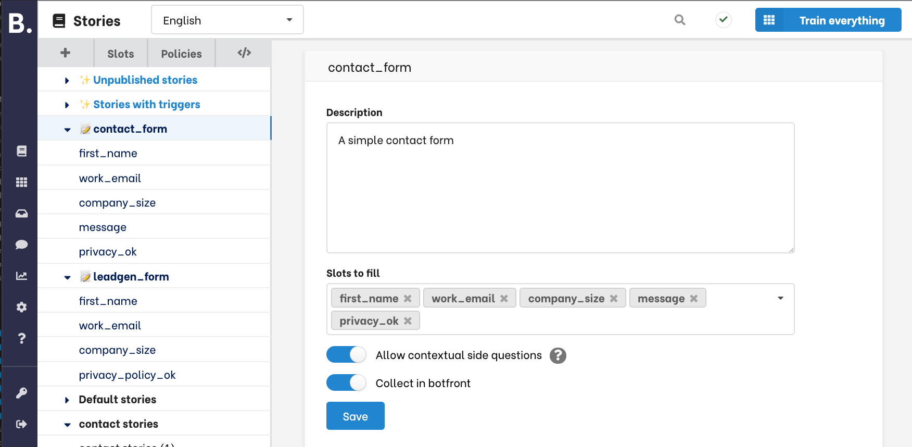

Available in: <Premium plan="Botfront Cloud" />  <Premium plan="Botfront Enterprise" />

# Slot filling and forms

<Important type="tip" title="In-depth tutorial available">
<a href="/blog/slot-filling-and-conversational-forms-part-1-getting-started">An in-depth step-by-step tutorial is available here</a>. We recommend starting there and use this documentation article as a reference.
</Important>

Stories are great to model conversation flows but they are not always sufficient to implement slot filling.
Slot filling is an iterative process during which questions are asked and responses are validated.

Slot filling can be used to prepare an API call (e.g asking travel requirements before checking flights availability), or more generally to collect information such as user details in a contact form.

There are two mains steps in implementing forms:

- Creating and configuring the form
- Integrating the form in your stories.

## Creating and configuring forms

You can create a form from clicking the **+** button at the top of the sidebar.

Enter a name and type enter. The name should always end with `_form`. For example, `newsletter_form`, or `contact_form`.

When you create a form, you can add a description and list the slots you want to get filled.

When saving, the slots become visible in the sidebar under the newly created form. You can re-order slots if you want to change the order of the questions.

<video autoplay muted loop width="100%" controls>
  <source src="../../../videos/forms/form_creation.m4v" type="video/mp4"/>
  Your browser does not support the video tag.
</video>

<Important type="info">
Botfront will create unfeaturized slots for you if the slots you list don't exist.
</Important>

## Configuring slots

Remember that the output of a form is a list of slots filled with valid values.
We need to:

1. Specify the questions we want to ask for each slot we want to collect.
2. Specify validation rules.
3. Speficy how we want to extract the values (from an entity, an intent, the whole user message).

### Specify the questions

Under the **Question** tab you can specify the questions your assistant will ask to collect a value for each slot.

<Important type="info">
Note that the question is technically a Botfront response with all the responses features: you can add variations and highlight elements on the screen.
</Important>

You can use any response type:

### Validation

You can validate the user response and display a message depending on the result:

In the following example, we expect the value of the `first_name` slot to have more than 2 characters.

If the value is invalid, the error message will be uttered and the question will be repeated.

You can also optionnally display a confirmation message **when the slot is set and valid**. This message will be uttered each time a new value is set for the slot: when the question is answered for the first time, or when the user changes it later in the flow.

Note that you can use the value of the slot in these messages.

<Important type="tip">
It's a good idea to add variations to make the assistant less robotic while repeating questions.
</Important>

A variety of validation options are offered, and if they are not sufficient you can also **match** a [regular expression](https://cheatography.com/davechild/cheat-sheets/regular-expressions/).

### Specify how to extract information

There are several ways to extract information from an utterance.

#### From an entity

You may want to take the value from an entity: if the user says _my email is **james.dean@holywood.com**_ where **james.dean@holywood.com** is extracted as an `email` entity, this value will be used to fill the slot.

### From an intent

When asking the user to approve or reject the policy, it feels more natural to ask if they approve and expect a **yes** or **no** answer. Where **yes** carries the `affirm` intent and no the `deny` intent.

You can map the intent to the expected **approved** or **rejected** values as follows.

### From the user message

For more generic questions, such as free form messages, you can just fill the slot from the user message.

### Intent conditions

You may add further constraints on the intent.

For example, when collecting the email from an entity, you may want to ensure that the intent corresponds to declaring an email address (e.g _my email is **james.dean@holywood.com**_) and not something else such as _I wrote an email to **support@whatever.com** and no one replied_:

The **inclusive** condition below will make sure that the slot is filled from the `first_name` entity if and only if the intent `inform` is recognized. If any other intent is found the form will be interrupted and you will have to handle that in your story.

The **exclusive** condition below will always fill the `message` slot from the whole content of the user message, **unless** one of the listed intent is found. It will then interrupt the form and you can take the conversation from there in your story,

### Combining extractions

Combining extraction methods will allow your assistant to extract the slot with more robustness. When asking a first name, a user might answer _John_, or _I'm John_, or _my name is John_.
If the `inform` intent is found with a `first_name` entity the slot will be filled from the entity. Otherwise, the whole message will be taken.

In the **From the user message** condition we have excluded the **inform** intent in order to make both conditions mutually exclusive.

## Integrating the form in your stories.

Now that we have a form we may start using it in our stories.

### Handling the happy path

The simplest integration covers the ideal situation where the user is collaborative and answers all questions.
You only need to **start the form** in your story. 
Once it is active it is going ti iterate through all slots, ask questions, validate answers, etc.

You can **pick up after completion** to continue the conversation once all the slots have been filled succesfully.

<video autoplay muted loop width="100%" controls>
  <source src="../../../videos/forms/basic_story.m4v" type="video/mp4"/>
  Your browser does not support the video tag.
</video>

### Handling digressions

The recommended approach is to use branches and links to handle digressions. Please check our [in-depth tutorial](/blog/slot-filling-and-conversational-forms-part-1-getting-started) for an extensive example.

### Handling contextual questions

Contextual questions are questions with responses depending on information being collected. For example _Explain_ or _Why do you need this_.
Contextual questions must be explicitely enabled in the form configuration:

At training time, a categorical `requested_slot` will be added to the domain with all slots contained in all forms as categories.

<Important type="warning">
Once contextual questions are enabled/disabled for one form, it is enabled/disabled for all forms
</Important>

Please check our [in-depth tutorial](/blog/slot-filling-and-conversational-forms-part-1-getting-started) for an extensive example.

